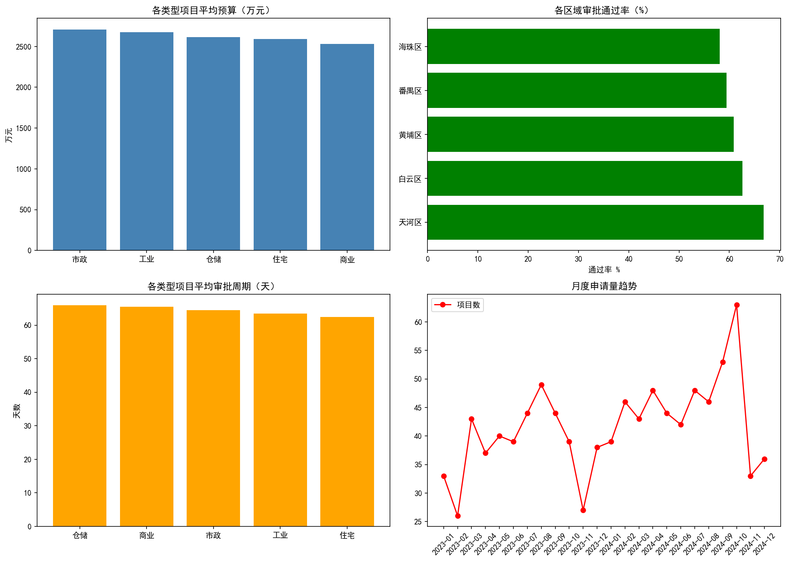

# Construction Project Data Analysis

## 项目背景
基于模拟的某市建设工程许可审批数据（1000条记录），分析项目成本分布、区域审批效率、时间趋势等核心业务指标。

## 技术栈
- **MySQL**: 数据存储与业务查询（聚合、CASE、DATEDIFF、DATE_FORMAT）
- **Python (pandas, matplotlib, SQLAlchemy)**: 数据生成、导入、可视化
- **VS Code**: 开发环境

## 核心分析维度
1. **项目类型平均预算**: 识别高资金需求业务线
2. **区域审批通过率**: 评估各区域政务效率差异
3. **平均审批周期**: 识别流程瓶颈（天）
4. **成本偏差分析**: 预算 vs 实际成本偏离度 TOP10
5. **月度申请趋势**: 业务量与资金需求的周期规律
## 分析结果预览



## 文件说明
| 文件 | 作用 |
|---|---|
| `generate_data.py` | 生成 1000 条模拟工程审批数据 |
| `import_to_mysql.py` | 将 CSV 批量写入 MySQL |
| `sql/queries.sql` | 5 个核心业务分析 SQL 查询 |
| `visualization.py` | 连接数据库，生成 4 维度分析图表 |
| `output/analysis_report.png` | 可视化输出结果 |

## 如何运行
```bash
# 1. 生成数据
python generate_data.py

# 2. 导入 MySQL（需先创建 construction_db）
python import_to_mysql.py

# 3. 执行 SQL 分析（在 MySQL 中运行 sql/queries.sql）

# 4. 生成可视化图表
python visualization.py

联系方式
 
姓名: 关皓昕
 
学校: 中山大学 · 土木工程（大二）
 
邮箱: 168891951@qq.com
